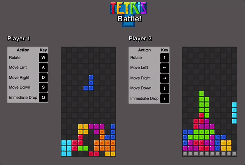

# Battle Tetris
The classic tetris with a twist! Defeat your friends or a computer by clearing lines on your board
and sending them to your opponent!



## Gameplay
The game consists of two players, one human and one human or computer.
Each player manipulates falling tetromino pieces to complete lines on their board.
As the player clears lines, their opponent's board fills up from the bottom with
unclearable lines, making gameplay harder for them.
A winner is determined when one player's tetromino stack height exceeds the
height of the game board.

## Tech Highlights
The key implementation technologies include Javascript and jQuery, as well
as some vanilla JS DOM manipulation.

### bitwise-operations
Tetromino movement and placement logic is handled by bitwise-operations on
tetromino pieces, which are modeled as 16-bit binary numbers, with each
bit representing a position on a 4x4 square grid:

```javascript
 0  1  2  3

 4  5  6  7

 8  9 10 11

12 13 14 15
```

The o piece, for example, takes up sites 0, 1, 4, and 5, and can
therefore be represented by the binary number 0b1100 1100 0000 0000.

The code responsible for placing or moving pieces is below. Note the bitwise-and
to determine if a piece should be placed at a grid location

```javascript
// board.js

/**
 * perform callback function on each position of grid occupied by
 * given tetromino located at (row, col) with given rotation.
 */
eachBlock(row, col, tetromino, rotation, callback) {
  let dRow = 0, dCol = 0;
  let tetrominoBlocks = tetromino.rotations[rotation];
  for (let currBit = 0b1000000000000000; currBit > 0; currBit >>= 1) {
    if (currBit & tetrominoBlocks) {
      callback(row + dRow, col + dCol);
    }
    dCol++;
    if (dCol > 3) {
      dCol = 0;
      dRow++;
    }
  }
}
```

###Observer Design Pattern
Communication between the boards is handled in accordance with the Observer
Design Pattern, where each instance of the board class exchanges callbacks
with the other, and registers the other's callback to call whenever a line is
cleared.

```javascript
// battle_tetris.js

/**
 * accept callback from opponent (Observer design pattern)
 */
registerListener(cb) {
  this.dropBlocksOnOpponent = cb;
}

/**
 * call callback on opponent to drop blocks on their board
 */
notifyListener(numBricks) {
  this.dropBlocksOnOpponent(numBricks);
}

playTurn() {
  // ...

  // drop bricks on opponent if rows cleared
  if (newlyClearedRows) this.notifyListener(newlyClearedRows);

  // ...
}
```
